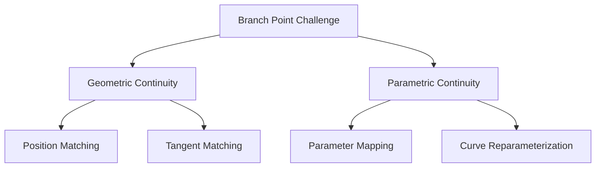
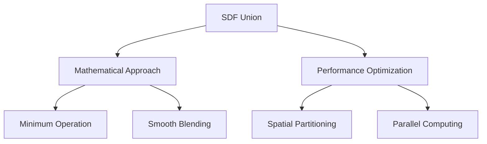
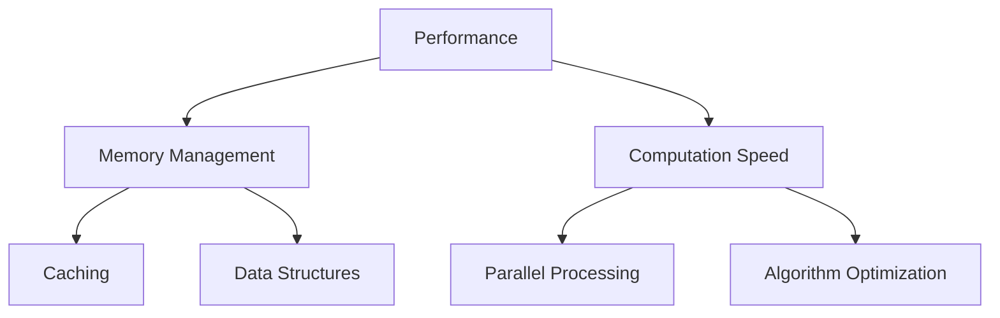

# SDFtoMesh Project Planning Document

## Project Overview

This project focuses on creating and visualizing Signed Distance Fields (SDFs) for 3D NURBS curves, with a particular emphasis on branching structures. The main goal is to create a unified SDF representation of a primary curve (trunk) with branching curves.

## Technical Challenges & Solutions

### 1. Branch Point Connection

**Challenge**: Ensuring smooth connection between trunk and branch curves.



**Solutions**:

- Position continuity through direct point matching
- Tangent alignment at connection points
- Reparameterization of branch curves if needed
- Validation checks for connection quality

### 2. SDF Union Operation

**Challenge**: Creating smooth, efficient union of multiple SDFs.



**Solutions**:

- Implement smooth minimum function for better blending
- Use spatial partitioning for efficient distance queries
- Optimize union operation for branching regions
- Handle overlapping regions with special cases

### 3. Performance Optimization

**Challenge**: Maintaining efficiency with multiple curves and complex unions.



**Solutions**:

- Implement caching for static curve data
- Use optimized data structures for distance queries
- Leverage parallel processing for SDF computation
- Implement adaptive grid resolution

## Architecture

### Core Components

1. **NURBS Curve Handling**
   - Using `geomdl` library for NURBS curve operations
   - Supporting multiple curves with branching relationships
   - Curve evaluation and point sampling

2. **SDF Computation**
   - Distance field calculation using KD-trees for efficiency
   - Union operation for combining multiple curve SDFs
   - Optimized grid point generation

3. **Visualization**
   - Interactive 3D plotting with Plotly
   - Curve visualization
   - SDF isosurface rendering
   - Branch point highlighting

## Detailed Class Structure

### BranchingCurveSystem Class

```python
class BranchingCurveSystem:
    """
    Main class for managing branching curve systems.
    """
    def __init__(self, trunk_curve: NURBS.Curve):
        self.trunk = trunk_curve
        self.branches: List[BranchCurve] = []
        self.branch_points: Dict[int, BranchPoint] = {}
        self._cached_kdtree = None
        
    def add_branch(self, curve: NURBS.Curve, location: float) -> bool:
        """
        Add branch at specified parameter location on trunk.
        
        Args:
            curve: The branch curve to add
            location: Parameter value on trunk curve
            
        Returns:
            bool: Success of branch addition
            
        Raises:
            ValueError: If connection point is invalid
        """
        
    def remove_branch(self, branch_id: int) -> bool:
        """Remove branch by ID"""
        
    def compute_sdf(self, points: np.ndarray) -> np.ndarray:
        """
        Compute combined SDF for entire system.
        
        Implementation:
        1. Compute trunk SDF
        2. Compute branch SDFs
        3. Apply smooth union operation
        4. Handle special cases near branch points
        """
```

### BranchPoint Class

```python
class BranchPoint:
    """
    Represents connection point between trunk and branch curves.
    
    Attributes:
        trunk_parameter: Parameter value on trunk curve
        position: 3D position of connection
        connected_branches: List of branch IDs
        tangent: Tangent vector at connection
    """
    def __init__(self, trunk_param: float, position: np.ndarray):
        self.trunk_parameter = trunk_param
        self.position = position
        self.connected_branches: List[int] = []
        self.tangent: np.ndarray = None
        
    def validate_connection(self, branch: NURBS.Curve) -> bool:
        """
        Verify branch connects properly to trunk.
        
        Checks:
        1. Position continuity
        2. Tangent continuity
        3. Parameter compatibility
        """
```

### SDF Implementation Details

#### Distance Field Computation

```python
def compute_curve_sdf(curve: NURBS.Curve, points: np.ndarray, 
                     cache: Optional[Dict] = None) -> np.ndarray:
    """
    Compute SDF for single curve using optimized KD-tree.
    
    Implementation:
    1. Check cache for existing KD-tree
    2. Build or retrieve KD-tree
    3. Compute distances efficiently
    4. Update cache if needed
    """
    if cache and curve.id in cache:
        kdtree = cache[curve.id]
    else:
        kdtree = build_optimized_kdtree(curve)
        if cache is not None:
            cache[curve.id] = kdtree
            
    return compute_distances(kdtree, points)
```

#### Union Operation

```python
def smooth_min(sdf1: np.ndarray, sdf2: np.ndarray, k: float = 0.1) -> np.ndarray:
    """
    Implement smooth minimum for better SDF blending.
    
    Args:
        sdf1, sdf2: Input distance fields
        k: Smoothing factor (smaller = sharper)
        
    Implementation:
    1. Compute weight factors
    2. Apply smooth interpolation
    3. Handle special cases
    """
```

## Testing Strategy

### Unit Tests

```python
class TestBranchingSystem(unittest.TestCase):
    def setUp(self):
        """Create standard test curves"""
        self.trunk = create_test_trunk()
        self.branch = create_test_branch()
        self.system = BranchingCurveSystem(self.trunk)
    
    def test_branch_connection(self):
        """Test branch connection validity"""
        # Position continuity
        # Tangent continuity
        # Parameter compatibility
    
    def test_sdf_computation(self):
        """Test SDF computation and union"""
        # Individual SDFs
        # Combined SDF
        # Special cases
```

## Performance Considerations

### Memory Management

1. **Caching Strategy**

   ```python
   class SDFCache:
       def __init__(self, max_size: int = 1000):
           self.cache = {}
           self.max_size = max_size
           
       def get_or_compute(self, curve: NURBS.Curve,
                         compute_fn: Callable) -> np.ndarray:
           """Get cached value or compute and cache"""
   ```

2. **Grid Optimization**

   ```python
   class AdaptiveGrid:
       def __init__(self, base_resolution: int = 50):
           self.base_resolution = base_resolution
           
       def get_resolution(self, region: BoundingBox,
                         curves: List[NURBS.Curve]) -> int:
           """Compute optimal resolution for region"""
   ```

## Future Extensibility

### Code Organization for Extensions

```
src/
├── core/
│   ├── curves/
│   │   ├── base.py
│   │   ├── nurbs.py
│   │   └── branch.py
│   ├── sdf/
│   │   ├── compute.py
│   │   ├── union.py
│   │   └── cache.py
│   └── visualization/
│       ├── plotly_utils.py
│       └── render.py
├── utils/
│   ├── geometry.py
│   └── optimization.py
└── tests/
    ├── test_curves.py
    ├── test_sdf.py
    └── test_visualization.py
```

This structure allows for:

- Easy addition of new curve types
- Alternative SDF computation methods
- Different visualization backends
- Extension to more complex topologies
