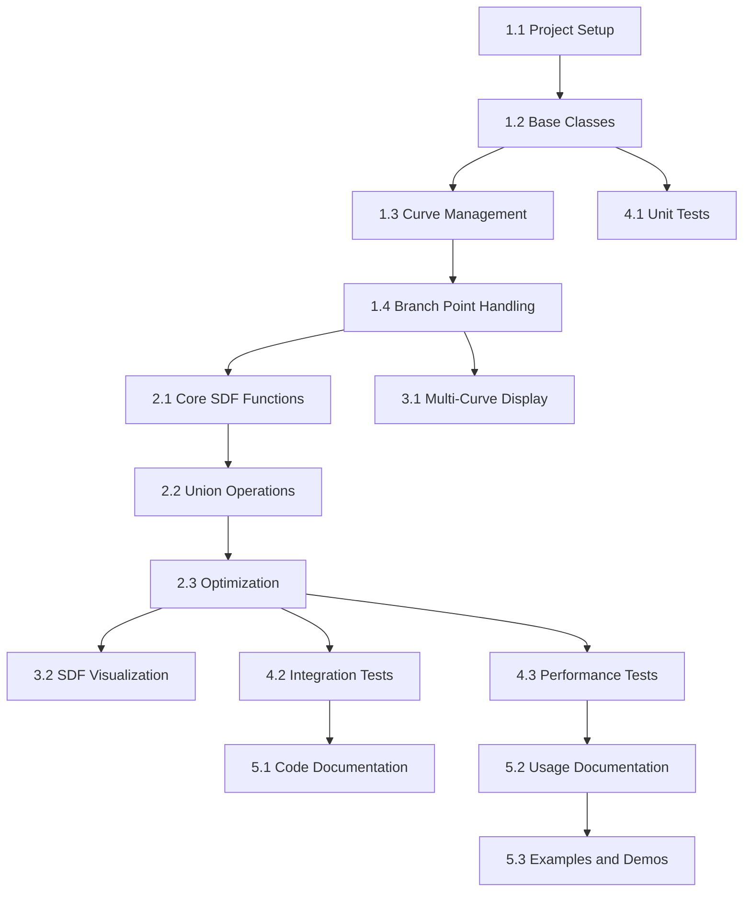

# Project Tasks

## April 8, 2025

- [x] **CurveSDF.py**: Refactor NURBS curve generation to use the `geomdl` library.
- [x] **CurveSDF.py**: Rewrite the code to use curve.evaluate() instead of the curve(t) function.
- [x] **CurveSDF.py**: Make the 3D plot interactive and visualize iso-surfaces of the SDF.

## New Tasks - Branching Curve Support

### Phase 1: Core Structure and Classes (Priority: High)

#### 1.1 Project Setup

- [ ] Create project directory structure following planned layout
- [ ] Set up testing framework and configuration
- [ ] Create initial package requirements

#### 1.2 Base Classes Implementation

- [ ] Create BranchingCurveSystem class skeleton
- [ ] Implement BranchPoint class with basic attributes
- [ ] Develop BranchCurve class with essential properties

#### 1.3 Curve Management

- [ ] Implement curve data structure for trunk and branches
- [ ] Add methods for parameter-based curve evaluation
- [ ] Create utility functions for curve manipulation

#### 1.4 Branch Point Handling

- [ ] Implement branch point detection algorithm
- [ ] Add validation for branch connections
- [ ] Create methods for branch point manipulation

### Phase 2: SDF Implementation (Priority: High)

#### 2.1 Core SDF Functions

- [ ] Extend current SDF computation for multiple curves
- [ ] Implement caching mechanism for KD-trees
- [ ] Add adaptive grid resolution support

#### 2.2 Union Operations

- [ ] Implement basic SDF union using minimum operation
- [ ] Add smooth minimum function for better blending
- [ ] Create specialized handling for branch points

#### 2.3 Optimization

- [ ] Implement shared KD-tree for multiple curves
- [ ] Add parallel processing support for SDF computation
- [ ] Create memory-efficient data structures

### Phase 3: Visualization (Priority: Medium)

#### 3.1 Multi-Curve Display

- [ ] Add support for displaying multiple curves
- [ ] Implement distinct coloring for trunk and branches
- [ ] Create branch point visualization

#### 3.2 SDF Visualization

- [ ] Extend isosurface rendering for multiple SDFs
- [ ] Add transparency and cross-section controls
- [ ] Implement interactive visualization options

#### 3.3 Debug Visualization

- [ ] Add debug view for branch points
- [ ] Create visualization for connection quality
- [ ] Implement SDF field strength display

### Phase 4: Testing and Validation (Priority: High)

#### 4.1 Unit Tests

- [ ] Create tests for curve operations
- [ ] Implement SDF computation tests
- [ ] Add branch point validation tests

#### 4.2 Integration Tests

- [ ] Test full branching system creation
- [ ] Validate SDF union operations
- [ ] Test visualization components

#### 4.3 Performance Tests

- [ ] Create benchmarks for SDF computation
- [ ] Test memory usage patterns
- [ ] Validate optimization effectiveness

### Phase 5: Documentation and Examples (Priority: Medium)

#### 5.1 Code Documentation

- [ ] Complete all class and method docstrings
- [ ] Add inline comments for complex algorithms
- [ ] Create API documentation

#### 5.2 Usage Documentation

- [ ] Write getting started guide
- [ ] Create examples for common use cases
- [ ] Document performance considerations

#### 5.3 Examples and Demos

- [ ] Create basic branching curve example
- [ ] Add complex branching pattern demo
- [ ] Implement interactive demo notebook

## Dependencies Between Tasks

## Success Criteria

### Functionality

- Successful creation and manipulation of branching curves
- Accurate SDF computation and union operations
- Smooth visualization of combined system

### Performance

- SDF computation time within acceptable limits
- Efficient memory usage for large systems
- Smooth interactive visualization

### Quality

- All tests passing
- Complete documentation
- Clean, maintainable code structure
